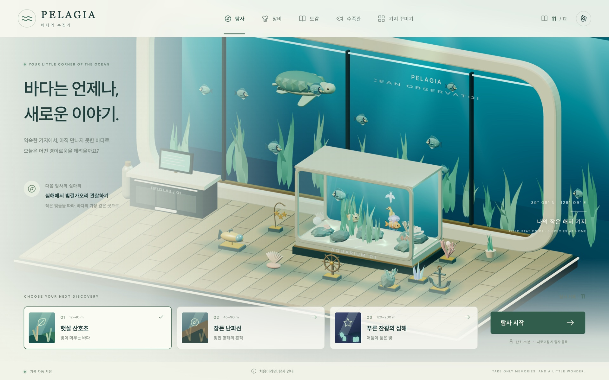

# PELAGIA — 바다의 수집가

햇살 산호초에서 발광 심해까지. 생물을 관찰하고 재료를 회수해 더 깊은 곳을 탐험하며, 함께 돌아온 생물로 나만의 수족관을 채우는 2.5D 스쿠버 게임입니다.

**[웹에서 플레이](https://dgh06175.github.io/my-game/)**

## 게임

- 해역 3곳, 생물 12종, 수족관 생물 6종, 장식 12종
- 매번 달라지는 지형·투하 지점·생물과 자원
- 관찰, 채집, 작살 사냥, 절단기로 여는 난파선 통로
- 산소와 체력을 관리하며 귀환 비콘으로 수집품 회수
- 장비 제작, 도감, 수족관, 격자 자유 배치로 꾸미는 해저 기지
- 최종 해역의 빛결가오리를 기록하면 첫 목표 달성. 이후에도 계속 탐사 가능

### 조작

| 행동           | PC                                      | 모바일 가로 화면      |
| -------------- | --------------------------------------- | --------------------- |
| 수영           | WASD 또는 방향키                        | 왼쪽 이동 패드        |
| 조준·도구 사용 | 마우스 조준, 클릭/길게 누르기           | 오른쪽 패드 조준/유지 |
| 도구 전환      | 1 스캐너 · 2 채집망 · 3 작살 · 4 절단기 | 도구 버튼             |
| 재료 수집·귀환 | E                                       | 화면 상호작용 버튼    |
| 일시정지       | Esc                                     | 일시정지 버튼         |
| 기지 배치      | 물건 선택 → 바닥 클릭                   | 물건 선택 → 바닥 터치 |

스캐너는 가까운 생물을 조준한 채 유지합니다. 작은 생물은 채집망으로 데려오고, 큰게·곰치·아귀는 작살로 사냥합니다. 필수 장비에는 사냥으로 얻는 재료가 필요합니다. 노란 신호는 설계도 또는 최종 생물의 방향, 초록 신호는 가까운 귀환 비콘의 방향입니다.

### 저장과 탐사 실패

진행은 이 브라우저의 IndexedDB에 자동 저장됩니다. 서버나 계정은 필요하지 않습니다. 기기 간에는 설정의 저장 파일 내보내기/가져오기를 사용하세요.

체력·산소가 소진되거나 탐사 중 새로고침·탭 종료를 하면 이번 수집품을 잃습니다. 도감, 기존 장비·보관품·기지는 남습니다. 다른 탭으로 잠시 이동하거나 모바일을 세로로 돌리면 일시정지됩니다.

에셋과 글꼴 라이선스는 [ASSETS.md](ASSETS.md)를 참고하세요.
